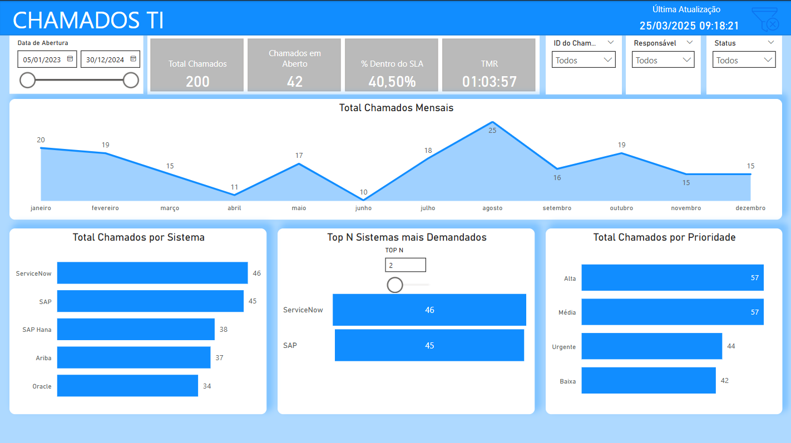

👋 Olá! Eu sou uma profissional apaixonada por transformar dados em decisões.
Com ampla experiência em Power BI, DAX e modelagem, venho construindo soluções que não apenas funcionam — mas fazem sentido para o negócio.

No meu dia a dia, gosto de garantir que tudo esteja bem estruturado: dos relacionamentos entre tabelas à apresentação final no dashboard. E quando surge um desafio, gosto de ser a pessoa que ajuda a resolver, seja com performance, lógica ou visual.

Aqui neste portfólio você vai encontrar alguns exemplos do meu trabalho e da forma como penso dados.

# 📊 Painel de Chamados TI



## 📝 Sobre o Projeto  
Este painel foi desenvolvido em **Power BI** para monitorar chamados de TI, fornecendo insights sobre tempos de resolução, status dos chamados e eficiência operacional.  
Os dados foram gerados **ficticiamente** usando um script Python.  

## 🔍 Funcionalidades  
✅ Monitoramento do **Tempo Médio de Resolução (TMR)**  
✅ Indicadores de **SLA cumprido**  
✅ **Top 2 Sistemas** mais acionados  
✅ **Total de Chamados por Prioridade**  
✅ **Filtros interativos** para análise dinâmica  

## 🛠️ Tecnologias Utilizadas  
- **Power BI**  
- **DAX (Data Analysis Expressions)**  
- **Python (para geração da base fictícia)**  

## 📂 Arquivos  
- `Painel.pbix` → Arquivo do Power BI  
- `Painel.png` → Print do dashboard  
- `gerar_base.py` → Script Python para gerar a base  
- `chamados_ti.csv` → Base fictícia gerada pelo script 

## 📊 Como Gerar a Base  
Se quiser rodar o script e gerar a base novamente:  
1. Instale as bibliotecas necessárias:  
   ```bash
   pip install pandas numpy
2. Execute o script Python:   
   ```bash
   python gerar_base.py
   
 ## 🌐 Projetos Web 
 📌 **Tecnologias:** HTML, CSS, JavaScript  
📌 **Descrição:** Landing page responsiva para apresentação de uma empresa.  
🔗 **[Repositório no GitHub](https://github.com/Firstaces/AnimacoesEducativas.git)**

## 📩 Contato
📧 E-mail: andreia33.ferreira@yahoo.com.br
💼 LinkedIn: https://www.linkedin.com/in/andreiaaferreira 

